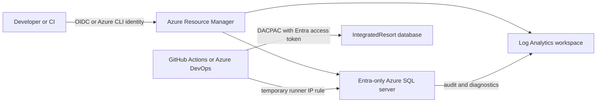

# Integrated Resort Database as Code

An Azure SQL database project that demonstrates operations for a fictional multi-property integrated-resort portfolio. It focuses on hotel, MICE, event service, finance, loyalty, and sustainability workflows. It does not model patron gaming activity.

All organizations, properties, markets, people, bookings, capacities, prices, meter readings, and operational details in this repository are synthetic examples. The project does not represent or imply affiliation with any real organization.

## Architecture



The development template uses a serverless General Purpose database with auto-pause. The production parameters disable public access and assume a private endpoint plus a self-hosted deployment agent will be supplied by the hosting platform.

## Demonstrated capabilities

| Area | Examples |
| --- | --- |
| Relational design | Primary, foreign, unique, default, and check constraints |
| Programmability | Scalar function, views, TVP, transactional procedures, trigger |
| Performance | Clustered, covering, and filtered indexes; persisted computed columns |
| Data lifecycle | Temporal venue history and `rowversion` concurrency |
| Data formats | JSON event configuration with `ISJSON` validation |
| Security | Entra-only Azure SQL, masking, row-level security, schema roles, TLS 1.2 |
| Operations | Idempotent seed scripts, Azure Monitor diagnostics, SQL auditing, smoke test |
| Delivery | DACPAC, Bicep AVM modules, GitHub Actions, Azure DevOps, local PowerShell |

The database model is under [azuredbsqlproj](azuredbsqlproj). The main operational view is [EventOperationsSummary.sql](azuredbsqlproj/Events/Views/EventOperationsSummary.sql), and the transactional booking entry point is [usp_CreateEventBooking.sql](azuredbsqlproj/Events/StoredProcedures/usp_CreateEventBooking.sql).

## Build

Prerequisites are .NET 10 or a compatible .NET 8+ SDK and internet access to restore `Microsoft.Build.Sql`.

```powershell
dotnet build .\azuredbsqlproj\azuredbsqlproj.sqlproj --configuration Release
```

The DACPAC is written to `azuredbsqlproj/bin/Release/azuredbsqlproj.dacpac`.

## Deploy from a workstation

Prerequisites:

- Azure CLI authenticated with `az login`
- Permission to create resources in the target resource group
- The signed-in principal configured as the template's Microsoft Entra SQL administrator
- `Microsoft.Sql` and `Microsoft.OperationalInsights` registered in the subscription

Use the service principal **object ID**, not its application/client ID:

```powershell
.\scripts\Deploy-Database.ps1 `
  -ResourceGroupName rg-integrated-resort-dev `
  -Location westus3 `
  -AdministratorLogin integrated-resort-deployer `
  -AdministratorObjectId 00000000-0000-0000-0000-000000000000
```

The script validates Bicep, builds the DACPAC, creates a narrowly scoped temporary firewall rule for the caller's public IP, publishes with an Azure SQL access token, runs [SmokeTest.sql](tests/SmokeTest.sql), and removes the rule in `finally`. Review the Azure SQL and Log Analytics costs before deployment.

When the deploying identity is a Microsoft Entra **user** rather than an application, pass `-AdministratorPrincipalType User` so the user is registered as the Azure SQL Entra administrator.

## GitHub Actions

Create a GitHub environment named `development`, configure an Entra federated credential for the repository/environment, and add these environment variables:

| Variable | Meaning |
| --- | --- |
| `AZURE_CLIENT_ID` | Federated application's client ID |
| `AZURE_TENANT_ID` | Microsoft Entra tenant ID |
| `AZURE_SUBSCRIPTION_ID` | Target Azure subscription ID |
| `AZURE_RESOURCE_GROUP` | Development resource group name |
| `AZURE_LOCATION` | Azure region, for example `westus3` |
| `AZURE_PRINCIPAL_NAME` | Display name configured as Azure SQL Entra administrator |
| `AZURE_PRINCIPAL_OBJECT_ID` | Service principal object ID, not client ID |

The workflow at [.github/workflows/database.yml](.github/workflows/database.yml) validates pull requests and deploys non-PR runs. Protect the environment with reviewers for production use.

## Azure DevOps

Create an Azure Resource Manager service connection using workload identity federation. Define `azureServiceConnection`, `azureResourceGroup`, `azureLocation`, `azurePrincipalName`, and `azurePrincipalObjectId` as pipeline or variable-group values. No client secret or SQL password is required. The pipeline is [azure-pipelines.yml](azure-pipelines.yml).

## Row-level security

Application sessions must set the allowed property before querying or modifying protected rows:

```sql
EXEC sys.sp_set_session_context @key = N'PropertyId', @value = 1, @read_only = 1;
```

Production applications should map this value from trusted identity claims in the data access layer; never accept it directly from an untrusted request.

## Production hardening

The supplied production parameter file disables public network access. Add a private endpoint and private DNS through the SQL AVM module, run deployment agents inside the connected virtual network, use zone redundancy where supported, configure backup retention to policy, and route alerts to an owned operations channel before treating this as a production platform.
